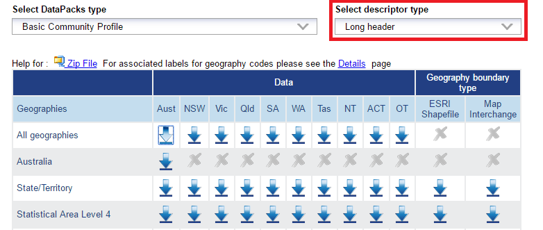

# ABS Datapack Formatter

Take datapacks downloaded from http://www.abs.gov.au/websitedbs/censushome.nsf/home/datapacks and format into csv for further processing.

This can be used as an alternative to tablebuilder.

## Install dependencies

**Note**: `psychopg2` is only required if writing to postgres

```
pip install pandas sqlalchemy PyYAML progressbar psycopg2
```

## Setup and Use

Download the basic community profile, long header, for all of Australia geographies from the ABS website: http://www.abs.gov.au/websitedbs/censushome.nsf/home/datapacks.

For the example `variables.yaml` to work, and to work with easier to understand variables in general, ensure you download the long header form:



### Create the database:

`python create_database.py {DATAPACK_LOCATION}/2011_BCP_ALL_for_AUST_long-header/2011\ Census\ BCP\ All\ Geographies\ for\ AUST  {OUTPUT_DATABSE}`

### Create the dataset:

You may write to CSV

`python create_dataset.py {DATABSE} variables.yaml {GEO_LEVEL} {OUTPUT_FILE}`

...or postgres

`python create_dataset.py {DATABSE} variables.yaml {GEO_LEVEL} {OUTPUT_FILE} --output-type postgres --table-name {TABLE_NAME}`

Where `{GEO_LEVEL}` is one of:
sa1, sa2, sa3, sa4
